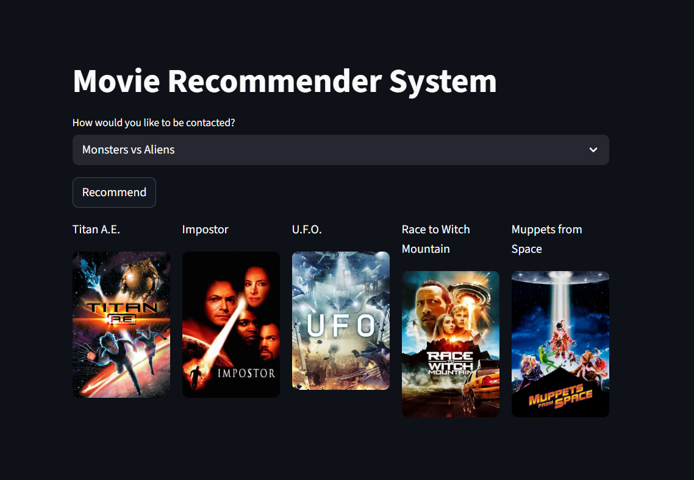

# Movie Recommender System ML Project

A machine learning powered movie recommendation system — built using Python — that lets users input a movie and get suggestions for other similar films. It includes model training components, a web app interface, and necessary assets to deploy and serve recommendations.

---

## Table of Contents

* [Features](#features)
* [Repository Structure](#repository-structure)
* [Requirements](#requirements)
* [Setup & Installation](#setup--installation)
* [How to Use](#how-to-use)
* [Model & Data](#model--data)
* [Deployment](#deployment)
* [Screenshots / Demos](#screenshots--demos)
* [Future Work](#future-work)
* [License](#license)

---

## Features

* Movie similarity based recommendations using collaborative filtering / content-based filtering / hybrid approaches
* Interactive interface (web app) to input a movie title & receive recommendations
* Pretrained model & serialized artifacts for fast inference
* Easy setup for deployment

---

## Repository Structure

```
├── app.py                 # Main flask / web-server entrypoint for serving recommendations
├── run_app.py             # Wrapper / script to launch the app
├── Movie-Recommendor-system.ipynb  # Notebook exploring data, building & evaluating models
├── movie_dict.pkl         # Serialized dictionary of movies / metadata for lookup
├── movies.pkl             # Serialized movie data (features / vectors) used for recommendations
├── requirements.txt       # Python dependencies
├── setup.sh               # (Optional) setup script for environment / services
├── Procfile               # For deployment (e.g. on Heroku)
├── runtime.txt            # Specifies runtime environment version (e.g. Python version)
├── ngrok_connect.py       # Utility to expose local server (if needed)
└── Data.zip               # Dataset(s) used for model training & evaluation
```

---

## Requirements

* Python 3.x
* Libraries listed in `requirements.txt` (Flask, Pandas, Scikit-Learn, etc.)
* Enough RAM & disk to load movie data and model artifacts

---

## Setup & Installation

1. Clone the repo:

   ```sh
   git clone https://github.com/mangal-singh001/Movie-Recommender-System-ML-Project.git
   cd Movie-Recommender-System-ML-Project
   ```

2. (Optional) Create a virtual environment:

   ```sh
   python3 -m venv venv
   source venv/bin/activate
   ```

3. Install dependencies:

   ```sh
   pip install -r requirements.txt
   ```

4. Extract data:
   Unzip `Data.zip` into a folder if needed (so that training / model notebooks can access raw data).

---

## How to Use

* **To explore / retrain model**:
  Open `Movie-Recommendor-system.ipynb`. It contains data loading, preprocessing, feature engineering, similarity computations, and evaluation.

* **To run the web app locally**:

  ```sh
  python app.py
  ```

  Then navigate to `http://localhost:5000` (or port printed in console) to access UI.

* **To get recommendations programmatically**:
  Use `movies.pkl` and `movie_dict.pkl` to lookup movie metadata & compute nearest neighbors or similarity.

---

## Model & Data

* Data: Movie metadata (titles, genres, etc.), user ratings (if used), feature vectors.
* Model / Technique: \[content-based / collaborative filtering / hybrid] (describe the approach here)
* Serialized artifacts:

  * `movies.pkl` — precomputed movie feature vectors / embeddings
  * `movie_dict.pkl` — mapping from movie titles / IDs to metadata used by app

---

## Deployment

* `Procfile` and `runtime.txt` suggest readiness for deployment to platforms like Heroku.
* Use `setup.sh` for any initial setup required on the server.
* If exposing local server for remote testing / demos, `ngrok_connect.py` may be useful.

---

## Screenshots / Demos

*Insert here a few example screenshots showing the UI, recommendation output, etc.*

For example:

---


!\[Recommendation Demo]\(Example (2).png)

---

## Future Work

Here are some potential enhancements:

* More advanced model (matrix factorization, neural embedding, deep learning)
* Use user rating data to incorporate collaborative filtering
* Improve UI / add search, autocomplete movie titles
* Scale for larger datasets, more movies
* Deploy with containerization (Docker)

---

